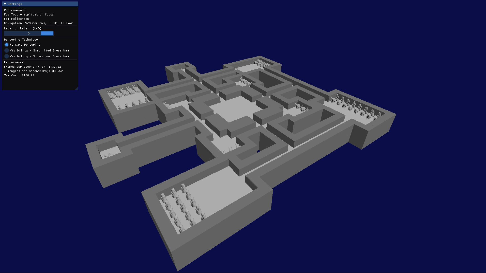

# Scalable Rendering for Graphics and Game Engines (SRGGE) Lab Project


## Table of contents
* [General info](#general-info)
* [How to run](#how-to-run)
* [Implemented techniques](#implemented-techniques)
* [Application output](#application-output)

## General info
The goal of this project is to get familiar with various scalable techniques that allow us to render complex meshes.

## How to run

Dependencies:
```
- (!) Important: Use in Linux. Developed and tested in Ubuntu, I don't know about other distributions.
- (!) Important: Use QtCreator 5. Different versions of Qt will probably cause errors.
- Eigen3 (to get: sudo apt install libeigen3-dev).
```

To compile:
```
- Go to BaseCode folder, and open a terminal there.
- run: mkdir build
- run: cd build
- run: cmake ..
- run: make
```

To run:
```
- First, run the Visibility executable. Inside the ~/build folder, run: ./Visibility
- This will create 2 visibility .txt files inside (origin of project)/extras/grid folder.
- Then, run the BaseCode executable. Inside the ~/build folder, run: ./BaseCode
- It will take some time to load the scene, because it will need to create the models' Levels-of-Detail (LODs) first.
- The created LODs will be stored in the same folder as the models inside (origin of project)/extras/models folder.
(!) Important: In case the loaded scene has "broken" meshes and LODs, terminate and re-run the BaseCode application.
```

## Implemented techniques
- Created an ImGui for easy parameter configuration and method selection.
- Rendered a "complex" museum floor-wall plan, with 10 rooms full of meshes (+ central area), via a .txt translation.
- Computed simplified versions of the loaded model using vertex clustering on a regular grid, using a mean representative.
**Extra**: Used an octree to generate all simplified models simultaneously.
- Created a 2nd application (Visibility) to precompute cell-to-cell visibility using random visibility sampling (Simplified Bresenham).
**Extra**: Also implemented an optimization to the visibility precomputation (Supercover Bresenham).

## Application output
Overview of the scene using simplified models|
:-------------------------:|
|
